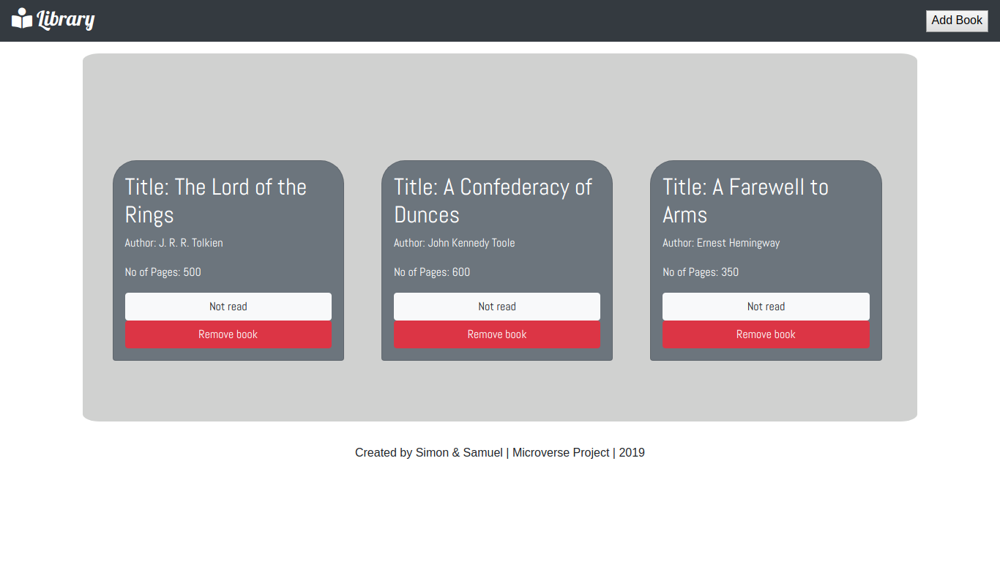

 

  

  <h3 align="center">Library</h3>

  

    JavaScript Project
     
     
    <a href="#">View Demo</a>
    ·
    <a href="https://github.com/samgaco/library/issues">Report Bug</a>
    ·
    <a href="https://github.com/samgaco/library/issues">Request Feature</a>
  

<!-- TABLE OF CONTENTS -->
## Table of Contents

* [About the Project](#about-the-project)
  * [Built With](#built-with)
* [Contact](#Contact)

<!-- ABOUT THE PROJECT -->
## About The Project

  
  
Based on the [ library project](https://www.theodinproject.com/courses/javascript/lessons/library) in the odin project as a part of the Microverse curriculum. The purpose was to have a first contact with javascript.

The project is able to get input data of books (with datafields; title, author, number of pages and status), remove the inputs and change the status of the books from "read" to "not read".

### Built With
* [JavaScript](https://www.javascript.com/)

### Contact

* [Simon Wathigo](https://github.com/wathigo)
* [Samuel García Companys](https://github.com/samgaco) - samuelgarciacompanys@gmail.com - [Linkedin](https://www.linkedin.com/in/samuel-garc%C3%ADa-companys-0a848284/)

